# Deploying Dynamic Website using LEMP Stack Setup on Ubuntu

The **LEMP stack** (Linux, Nginx, Mysql, PHP) is one of the most popular open-source platforms for hosting **dynamic websites and applications**.<br>This project demonstrates how to set up a complete **LEMP environment** on an **Ubuntu EC2** instance, making it easy to deploy and manage **dynamic websites** in the cloud. 

---

## ➤ Components
- **Linux** → Operating System (Ubuntu)  
- **Nginx** → Web Server  
- **MySQL** → Database Server  
- **PHP** → Server-side scripting  

---

## ➤ Steps to Deploy

### ✔ STEP 1️:- Launch an EC2 Instance
- OS: **Ubuntu**
- Instance type: `t3.micro` (Free tier eligible)

  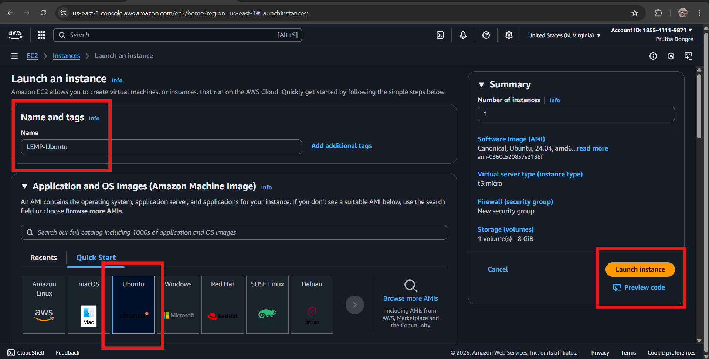

---
### ✔ STEP 2:- Allow Security group: 
  Allow **SSH (22)** and **HTTP (80)** inbound rules
 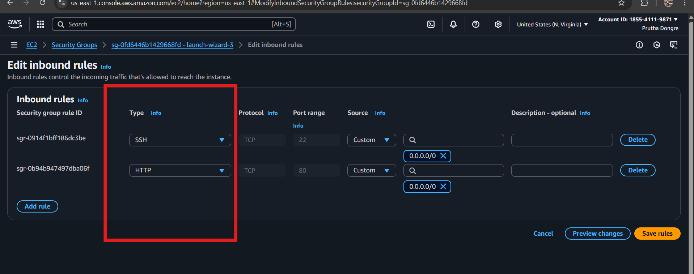

---
### ✔ STEP 3:- Connect to EC2 Instance
```bash
ssh -i "your-key.pem" ubuntu@<your-ec2-public-ip>
```
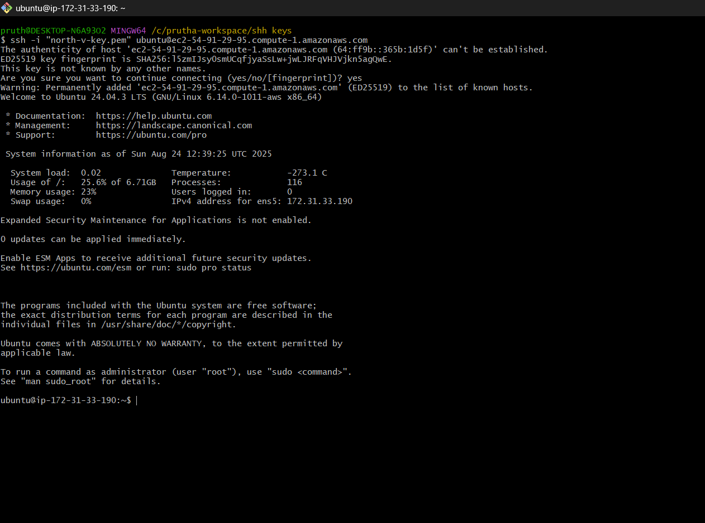

---
### ✔ STEP 4:- Update System Packages
```bash
sudo apt update -y
```
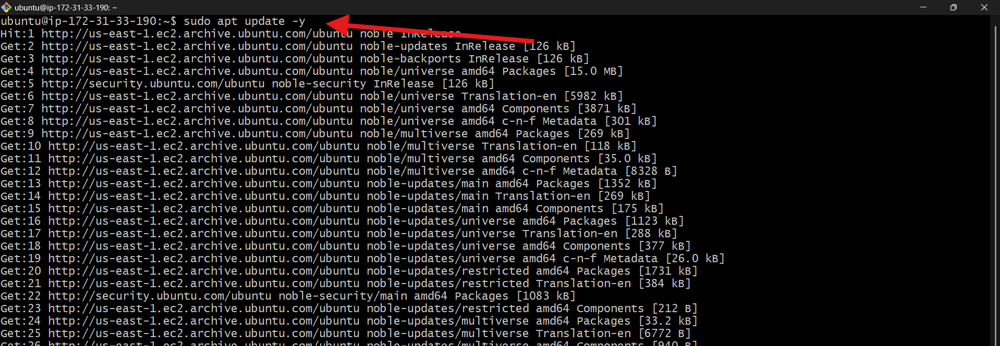

---
### ✔ STEP 5:- Install, start, enable and check status of Nginx 
```bash
sudo apt install nginx -y
```
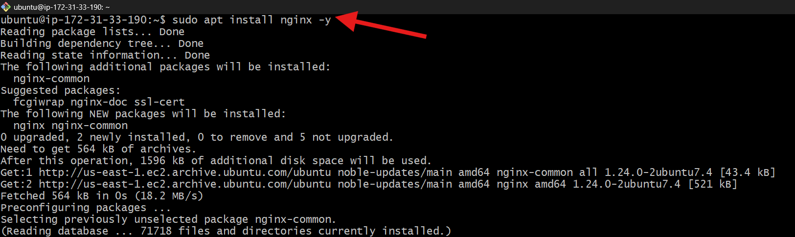


```bash
sudo systemctl start nginx
sudo systemctl enable nginx
sudo systemctl status nginx

```
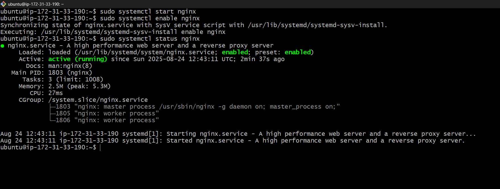


---
### ✔ STEP 6:- Install, start, enable and check status of mysql 
```bash
sudo apt install mysql-server -y
```
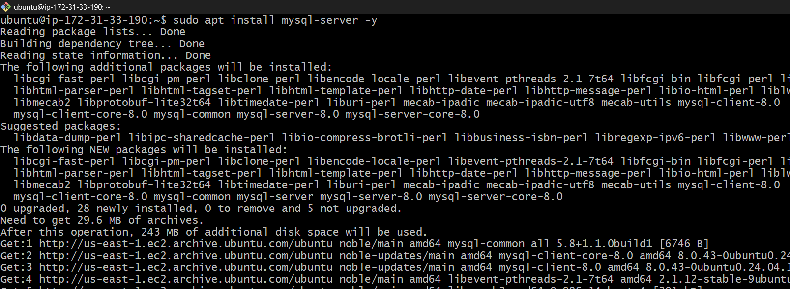

```bash
sudo systemctl start mysql
sudo systemctl enable mysql
sudo systemctl status mysql
```
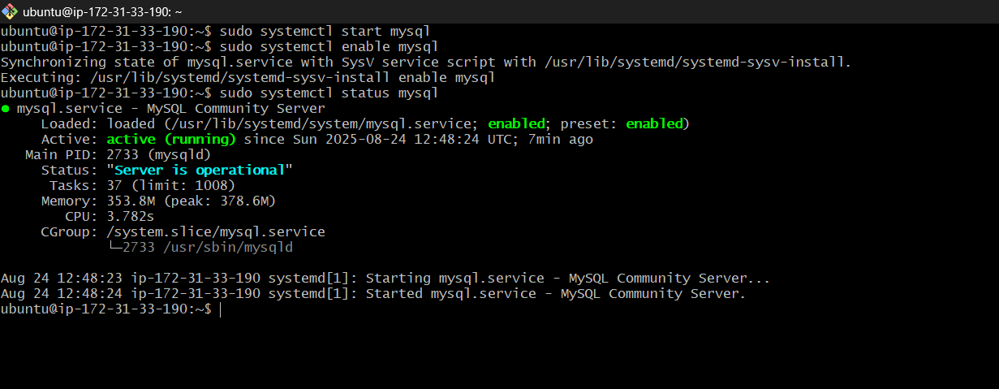

---
### ✔ STEP 7:- Install, start, enable and check status of PHP
```bash
sudo apt install php -y
```
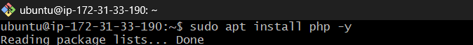

```bash
sudo apt install php8.3-fpm -y
```


```bash
sudo systemctl start php8.3-fpm
sudo systemctl enable php8.3-fpm
sudo systemctl status php8.3-fpm
```
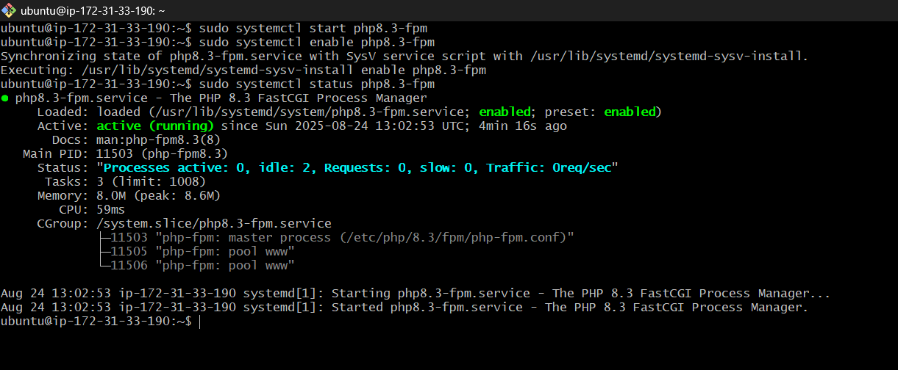

---
### ✔ STEP 8:- Create HTML and PHP Page
- go to default directory
```bash
cd /var/www/html/
```
- remove existing index.html and create new own index.html
```bash
sudo rm -r index.html
sudo vim index.html
```
add
```html
<h1>Hello, LEMP Stack is Working</h1>
```

- create index.php
```bash
sudo vim index.php
```
add
```php
<?php
   phpinfo();
?>
```
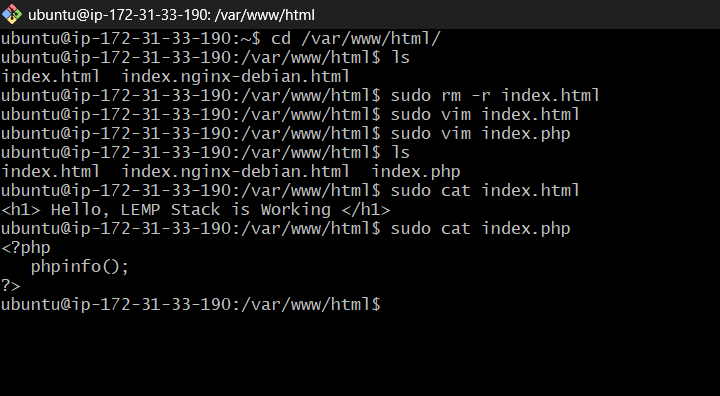

---
### ✔ STEP 9:- Configure Nginx to Process PHP
- change the default behaviour so that index.php will display in browser insted of downloading php page
```bash
cd /etc/nginx/sites-enabled/
sudo vim default
```
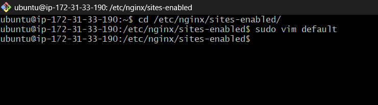
---
- Inside the default Nginx config file, uncomment the PHP location block and update the PHP-FPM version to match your installed PHP version.
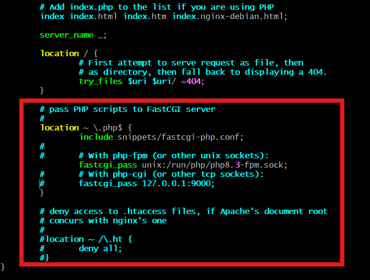

### ✔ STEP 10:- Restart Nginx Services
```bash
sudo systemctl restart nginx
```
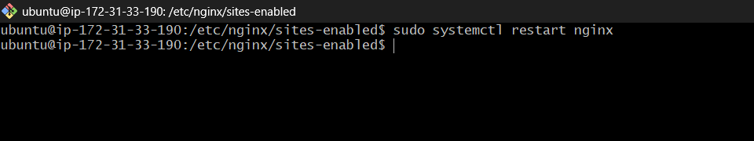

---
### ✔ STEP 11:- Verification
- Open in browser:
  - http://YOUR_SERVER_IP/index.html → HTML works
  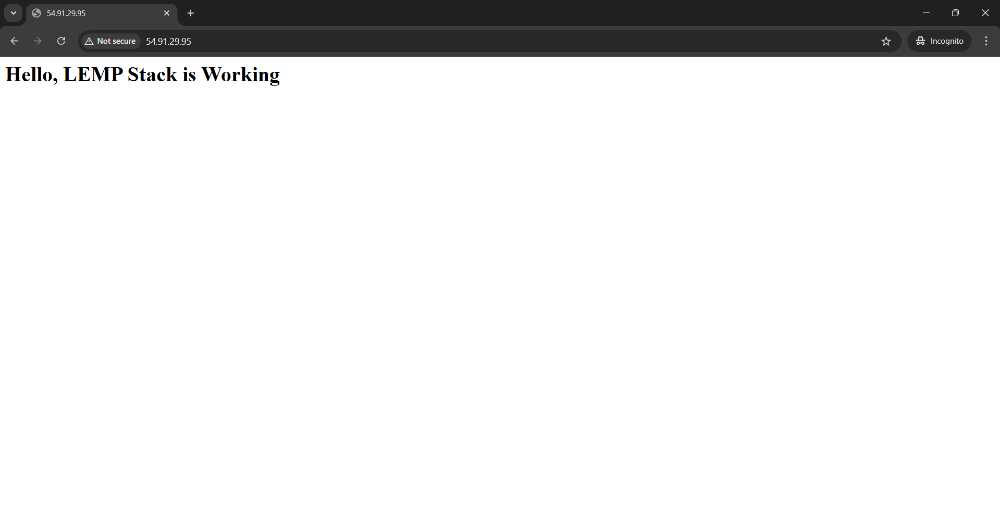
  
  - http://YOUR_SERVER_IP/index.php → PHP info page
  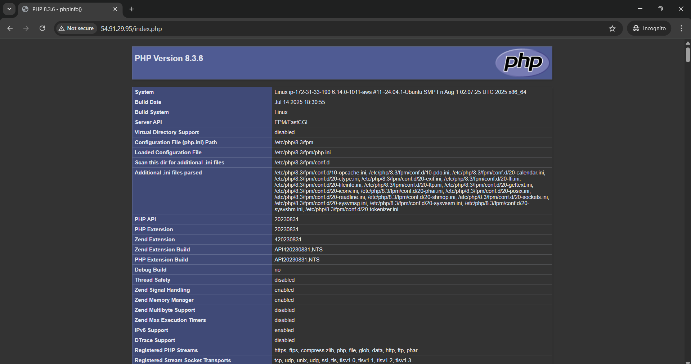

---

## ➤ Summary
This project demonstrates the deployment of a **dynamic website** on an **Ubuntu EC2 instance** using the **LEMP stack (Linux, Nginx, MySQL, PHP)**. The setup included installing and configuring Nginx as the web server, MySQL as the database server, and PHP with PHP-FPM for dynamic content processing. Test HTML and PHP pages were created to verify the environment, and the Nginx configuration was modified to ensure PHP files are executed properly instead of being downloaded. Finally, the services were restarted and validated in a browser, **confirming that the LEMP stack was working as expected**.
